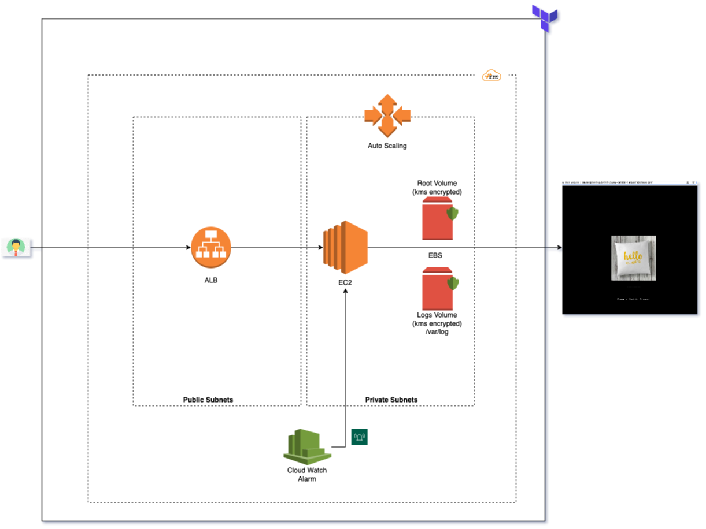

# terraform-app-deploy

## Architecture Diagram




---


## Usage

It can be used to create some basic AWS services that are responsible to host a scalable basic HTML web application.

| This includes: |
|------|
| VPC |
| Two each subnet (Public & Private) |
| Internet Gateway |
| NAT Gateway |
| Launch configuration |
| Autoscaling groups with scaling policies |
| EC2 node with Nginx and encrypted EBS mount (using user data) |
| Application load balancer with target groups |
| Secure security groups |
| Cloud watch for monitoring |
||
||


Module can be called like
```hcl
module "basic-app" {
  source = "git::https://github.com/rohit04apr/terraform-app-deploy"

  aws = {
	    access_key = ""
    	secret_key = ""
    	region = ""     
  }

  key_path = ""
}
```


<!-- markdownlint-disable -->
## Requirements

| Name | Version |
|------|---------|
| terraform | >= 0.12.0 |
| aws | >= 2.0 |

## Inputs

| Name | Description | Type | Default | Required |
|------|-------------|------|---------|:--------:|
| aws | Credentials for this AWS account. | `map(string)` | <pre> {access_key = "" <br> secret_key = "" <br> region = "eu-central-1"} </pre>  | yes |
| vpc | IP CIDR details for VPC creation | `map(string)` | <pre>{ vpc_cidr         = "10.0.0.0/16", <br> subnet_private_1 = "10.0.1.0/24" <br> subnet_private_2 = "10.0.2.0/24" <br> subnet_public_1  = "10.0.3.0/24" <br> subnet_public_2  = "10.0.4.0/24" }</pre> | no |
| instance | Launch Configuration details | `map(string)` | <pre>{ instance_type    = "t2.micro", <br> root_volume_size = 8 <br> logs_volume_size = 8 <br> as_min_size      = 1 <br> as_max_size      = 2 }</pre> | no |
| custom_tags | Custom tags which can be passed on to the AWS resources. They should be key value pairs having distinct keys. | `map(string)` | <pre>{ Environment = "development", <br> CreatedBy   = "terraform" }</pre> | no |
| key_path | Public key path. | `string` | `""` | yes |


## Outputs

| Name | Description |
|------|-------------|
| alb_endpoint | ALB endpoint to access web application |
